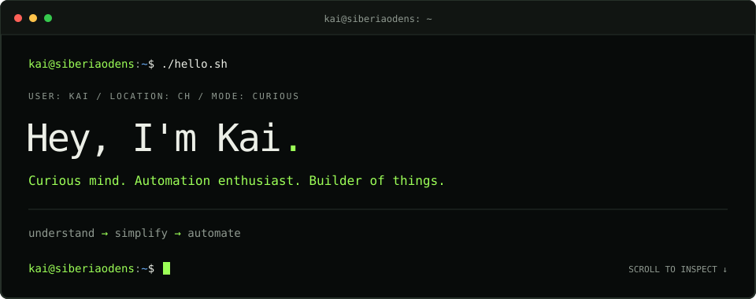

## 🚀 A little about me

I'm Kai, online as **siberiaodens**, based in Switzerland 🇨🇭. I like understanding what happens beneath the surface — then turning that curiosity into something useful. My interests span **automation, platforms, security, and AI**, with a soft spot for practical projects that make everyday life a little easier.

- 🏠 Tinkering with **Home Assistant**, connected devices, and smart-home automation.
- 🐍 Working with **Python, PowerShell, and Bash** to connect systems and simplify recurring tasks.
- 🐳 Exploring **Docker, Linux, and CI/CD** for repeatable setups and automated delivery.
- ⚡ Experimenting with **energy monitoring**, photovoltaic data, and MQTT.
- 🤖 Curious about **AI and workflow automation**, especially where they help solve everyday problems.
- 🎮 Away from the terminal, I enjoy gaming and exchanging ideas with other curious people.

## 🌿 What I'm currently building

### [Plant Watering for Home Assistant](https://github.com/siberiaodens/plant-watering-homeassistant)

A little more structure for keeping the plants happy. A **HACS custom integration** that gives each plant its own Home Assistant device with a **seasonal watering schedule**.

- **Per-plant configuration:** Separate watering intervals and water amounts for spring, summer, autumn, and winter.
- **Optional heat adjustment:** Shorter watering intervals when temperatures rise.
- **Watering history:** Record watering with a button and retain the last-watered date across restarts.
- **Automation-friendly entities:** Use watering status in your own reminders, automations, and dashboards; adjust seasonal values directly in Home Assistant.

**Built with:** Python · Home Assistant · HACS

[](https://github.com/siberiaodens/plant-watering-homeassistant/stargazers)
[](https://github.com/siberiaodens/plant-watering-homeassistant/issues)
[](https://github.com/siberiaodens/plant-watering-homeassistant/commits)

[Explore the project →](https://github.com/siberiaodens/plant-watering-homeassistant) · [Installation guide](https://github.com/siberiaodens/plant-watering-homeassistant#installation) · [Report a bug or suggest an idea](https://github.com/siberiaodens/plant-watering-homeassistant/issues)

## 🛠️ My toolbox

### Languages & scripting


### Platforms & development


### Smart home & integration


## 🤝 Feedback & contributions

Trying Plant Watering in your own setup? I'd love to hear what works and what could be better. Bug reports, feature ideas, documentation improvements, and pull requests are welcome.

- **Found a bug?** Open an [issue](https://github.com/siberiaodens/plant-watering-homeassistant/issues) with your Home Assistant and integration versions, steps to reproduce it, and relevant logs with personal details removed.
- **Have an idea?** Describe the use case in an issue so we can discuss it.
- **Want to contribute code or docs?** Small, focused [pull requests](https://github.com/siberiaodens/plant-watering-homeassistant/pulls) are a good place to start.

## 💭 How I approach things

```yaml
mindset:
  - Understand the whole system
  - Keep code and configuration readable
  - Automate what gets repeated
  - Build security in from the start
  - Document what helps the next person
  - Stay curious and keep experimenting
```


## 📬 Let's connect
<div align="center">

[](https://siberiaodens.com)
[](https://www.linkedin.com/in/siberiaodens/)
</div>

<div align="center">

---

*Understand how it works. Make it simpler. Automate the repetitive bits.*

</div>


